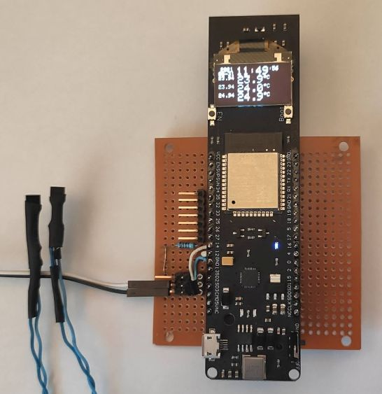

# esp32thm
ESP32 thermometer and clock

Reads three DS18B20 thermometers every second and computes the average for every minute.
Sends the average temperature values to [Arduino IoT Cloud](https://create.arduino.cc/iot). 

